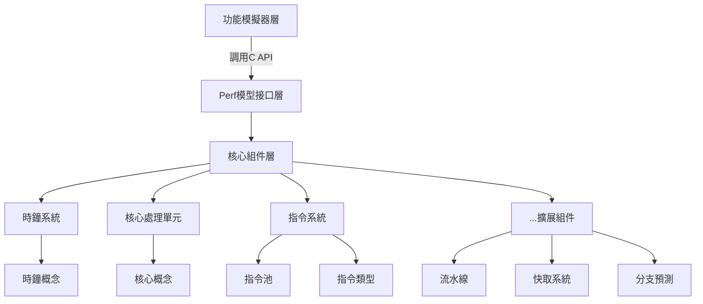
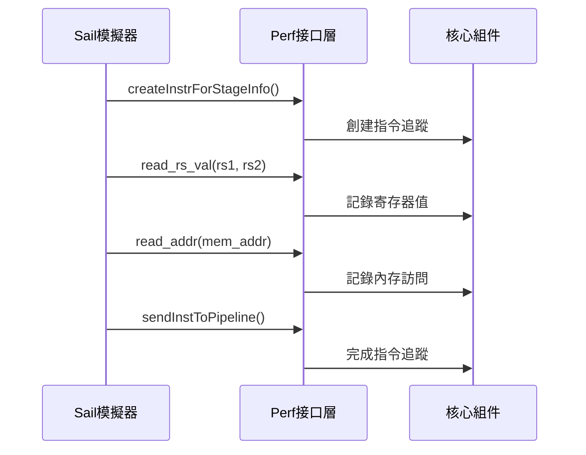
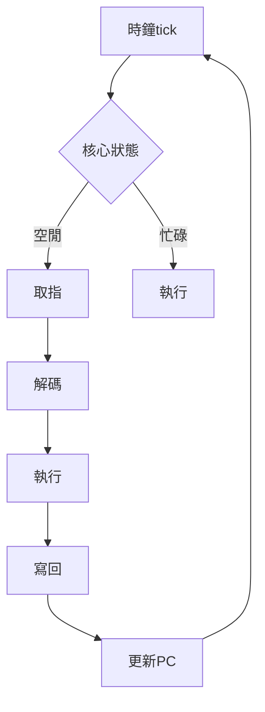

# Perf 微架構模擬器架構設計

## 1. 系統概述與設計目標

Perf 是一個**高度模組化的微架構CPU模擬器效能模型**，核心目標是：

- 🧩 提供可自由組裝的CPU部件（流水線、快取、分支預測單元等）
- 🔌 與功能模擬器（如Sail-RISC-V）無縫集成
- 📊 實現精細化的效能追蹤與分析
- 🚀 支持快速原型設計與架構探索

設計原則：
1. **編譯期多態**：零運行時開銷的接口約束
2. **鬆散耦合**：組件間通過明確定義的接口通信
3. **可擴展性**：易於添加新組件或替換現有實現

## 2. 分層架構



架構說明：
1. **功能模擬器層**：Sail-RISC-V等基礎模擬器
2. **Perf模型接口層**：提供C語言API供模擬器調用
3. **核心組件層**：
   - 基礎組件（時鐘/核心/指令）
   - 可擴展組件（流水線/快取等）

## 3. 核心組件接口定義

### 3.1 時鐘系統接口（ClockConcept）
```cpp
// src/Clock/Concept/ClockConcept.h
template <typename T>
struct ClockConcept {
    // 必須實現的接口
    static constexpr bool value = 
        std::is_same_v<void, decltype(std::declval<T>().tick())>;
};
```

### 3.2 核心處理單元接口（CoreConcept）
```cpp
// src/Core/Concept/CoreConcept.h
template <typename T>
struct CoreConcept {
    static constexpr bool value = 
        std::is_same_v<void, 
            decltype(std::declval<T>().read_inst(
                static_cast<Instruction*>(nullptr)))>;
};
```

### 3.3 指令系統關鍵結構
```cpp
// src/Instruction/Instruction.h
struct Instruction {
    // 指令元數據
    uint64_t addr;          // 指令地址
    InstructionType type;   // 指令類型
    RegNum rs1, rs2, rd;    // 寄存器操作數
    
    // 執行狀態
    uint64_t rs1_val, rs2_val; // 寄存器值
    bool taken;             // 分支是否跳轉
    
    // 指令分類方法
    bool is_load();
    bool is_store();
    bool is_branch();
    ExecutionUnitType get_execution_unit_type();
};
```

### 3.4 模型接口層API（perf_model.h）
```cpp
// model_interface/perf_model.h
extern "C" {
    // 指令生命週期事件
    unit createInstrForStageInfo();
    unit sendInstToPipeline();
    
    // 內存訪問事件
    unit read_addr(uint64_t addr);
    unit read_ls_addr(uint64_t addr);
    
    // 寄存器訪問事件
    unit read_rs_val(uint64_t rs1_val, uint64_t rs2_val);
    
    // 分支預測事件
    unit read_taken(bool taken);
}
```

## 4. 關鍵設計模式

### 4.1 策略模式（可替換組件）
```cpp
// 時鐘組件的策略實現
template <ClockConcept Clock>
class Processor {
    Clock clock;
public:
    void run_cycle() {
        clock.tick(); // 可替換不同時鐘實現
    }
};
```

### 4.2 編譯期多態（SFINAE）
```cpp
// 編譯期檢查組件是否符合接口
template <typename T>
enable_if_t<ClockConcept<T>::value>
use_clock(T& clock) {
    clock.tick(); // 僅當符合ClockConcept時編譯
}
```

### 4.3 觀察者模式（事件捕獲）
```sail
// Sail模擬器中的事件觸發
function step_instruction() {
    // ...
    read_rs_val(rs1_val, rs2_val); // 通知Perf寄存器讀取
    read_addr(mem_addr);           // 通知Perf內存訪問
    // ...
}
```

## 5. 數據流與控制流

### 5.1 指令生命週期數據流


### 5.2 控制流示例（時鐘驅動）


## 6. 設計決策理由

### 6.1 編譯期接口檢查（SFINAE）
- ✅ **零運行時開銷**：接口合規性在編譯階段驗證
- ✅ **強類型安全**：避免運行時類型錯誤
- ✅ **清晰錯誤訊息**：編譯失敗時明確指出缺失接口

### 6.2 C/C++混合編程
- ✅ **Sail兼容性**：Sail生成的C代碼可直接調用
- ✅ **性能考量**：C接口最小化調用開銷
- ✅ **隔離性**：C++實現細節對Sail透明

### 6.3 模塊化組件設計
- ✅ **可擴展性**：輕鬆添加新組件（如Cache/BPU）
- ✅ **可替換性**：組件實現可熱插拔
- ✅ **測試友好**：組件可獨立測試

### 6.4 基於事件的效能追蹤
- ✅ **精細度**：捕獲指令級別事件
- ✅ **低侵入性**：Sail模擬器只需少量修改
- ✅ **數據豐富**：支持多維度效能分析

## 7. 未來擴展方向

1. **流水線模組**：實現5級流水線模型
2. **分支預測單元**：添加預測算法組件
3. **快取層級**：可配置的L1/L2緩存
4. **多核支持**：核心間通信與一致性協議